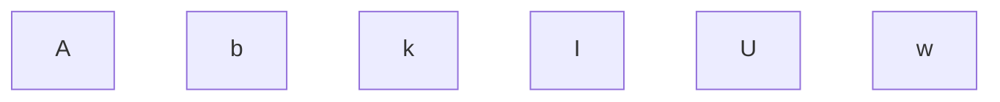
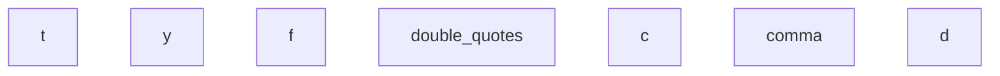
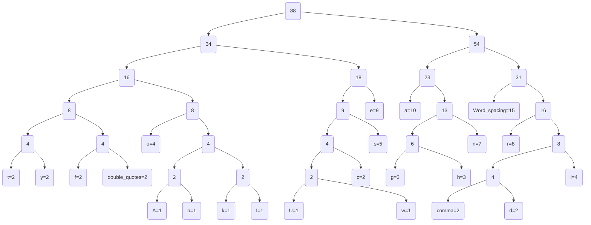
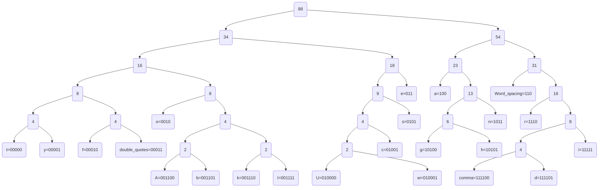

# Huffman coding

문자는 적은 비트로 된 코드로 변환해서 표현하고, 별로 사용되지 않는 문자는 많은 비트로 된 코드로 변환하여 표현함으로써 전체 데이터를 표현하는 데 필요한 비트의 양을 줄이는 방법이다.   

<br>

허프만 코딩에서는 압축 대상이 되는 데이터마다 최대한 효율적으로 압축될 수 있게끔 코드를 생성하고 그 체계에 따라 압축한다.
<br>

그렇게 되려면 데이터마다 각 문자에 대한 특정 코드가 정해져야만 하는데 이 때 필요한 것이 허프만 트리이다.
<br>

# Prefix code
접두 코드란 코드 집합에서 어떤 코드도 다른 코드의 접두사가 되지 않게 만들어진 코드이다.
<br>

예를 들어 {"0", "01"} 코드 집합의 경우 접두 코드가 아니다. "0"은 "01" 코드의 접두사이기 때문이다.
<br>

반대로 {"00", "010", "0111"}은 접두 코드이다. 이를 보면 어떤 코드도 다른 코드의 접두사에 포함되지 않는다는 것을 알 수 있다.
<br>

예를 들어, BCB 라는 문자열의 크기는 3Byte(24Byte) 이다.
B = 10
C = 110
이므로, BCB는 1011010 으로 7Bit로 압축된다.

# Huffman Tree

### 텍스트 파일에 사용된 예시문 :

 "As far as Ukrainians are concerned, the war has been going on for eight years already,"

<br>

<strong>1. Java 코드를 통해 나온 결과값들을 바탕으로 각각의 문자에 대해 node를 만든다.  

<br>

빈도수 1



빈도수2



빈도수3이상

```mermaid
graph TD
g=3
h=3
i=4
o=4
s=5
n=7
r=8
e=9
a=10
Word_spacing=15
```
<br>

<strong>2. 가장 작은 빈도수를 가진 두 개의 node를 더하여 부모 node를 만들고 이를 최종 root node 하나만 남을 때까지 반복한다.

<br>


<strong>3. 각각의 문자 node를 2진수 bit로 표현하면 다음과 같다.


<strong>4. 각 문자의 빈도수와 bit를 표현하면 다음과 같다.


   |        |   A    |   b    |   k    |   I    |   U    |   w    |     ,     |   d    |
| :----: | :----: | :----: | :----: | :----: | :----: | :----: | :-------: | :----: |
   | 빈도수 |   1    |   1    |   1    |   1    |   1    |   1    |     2     |   2    |
   |  bit   | 001100 | 001101 | 001110 | 001111 | 010000 | 010001 |  111100   | 111101 |
   |        | **f**  | **"**  | **c**  | **t**  | **y**  | **g**  |   **h**   | **i**  |
| 빈도수 |   2    |   2    |   2    |   2    |   2    |   3    |     3     |   4    |
   |  bit   | 00010  | 00011  | 01001  | 00000  | 00001  | 10100  |   10101   | 11111  |
   |        | **o**  | **s**  | **n**  | **r**  | **e**  | **a**  | **space** |        |
   | 빈도수 |   4    |   5    |   7    |   8    |   9    |   10   |    15     |        |
   |  bit   |  0010  |  0101  |  1011  |  1110  |  011   |  100   |    110    |        |

<br>   

<strong>5. 예시문  "As far as Ukrainians are concerned, the war has been going on for eight years already,"를 최종 압축된 문자열로 표현하면 다음과 같다.

<br>

```
0001100110001011100001010011101101000101110010000001110111010011111101111111100101101011101001110011110010010010101101001011111010110111111011111001100000010101011110010001100111011010101100010111000110101101110111101010000101111110111010011000101011110000100010111011001111111101001010100000110000010111001110010111010000111111100111001111010000111110000011
```

<br>

<strong>6. 압축률
  704bit 크기의 문자열이 358bit로 압축된 것을 확인할 수 있다.

<br>


# Code

<br>

<strong>1. 소스코드

<br>

```
// 우선순위 큐 정렬
class Node implements Comparable<Node> {
    char cData;
    int frequency;
    Node left, right;

    Node(){}
    Node(char cData, int frequency){
        this.cData = cData;
        this.frequency = frequency;
    }

    @Override
    public int compareTo(Node node) {
        return frequency - node.frequency;
    }
}
```
```
public class Huffman {


    private static Scanner scan = new Scanner(System.in);
    private static Map<Character, String> prefixCodeTable = new HashMap<>();

    // test.txt의 문자를 읽어온다.
    public static void main(String args[]){ 
        String content ="";
        Path path = Paths.get("test.txt");
        try {
            content = Files.readString(path);

        }catch (IOException e){
            e.printStackTrace();
        }
        // 원본 데이터
        String data = content;
        System.out.println("Original data : " + data);

        // 인코딩 데이터
        String encodeData = encode(data);
        System.out.println("Encoded data : " + encodeData);

        // 디코딩 데이터
        String decodeData = decode(encodeData);
        System.out.println("Decoded data : " + decodeData);
        System.out.println();

        // 출력
        int originDataByteSize = data.getBytes(StandardCharsets.UTF_8).length;
        System.out.println("기존 데이터 크기 : " + originDataByteSize * 8 + "Bit (" + originDataByteSize + "Byte)");
        int encodeDataByteSize = encodeData.length() % 8 == 0 ? encodeData.length() / 8 : encodeData.length() / 8 + 1;
        System.out.println("압축된 데이터 크기 : " + encodeData.length() + "bit (" + encodeDataByteSize + "Byte)");
        System.out.println("압축률 : " + encodeDataByteSize/(float)originDataByteSize*100 +'%');
    }
```
```
    // 문자열 빈도 구하기
    // 같은 문자열인 경우 빈도수 증가
    public static String encode(String data){
        Map<Character, Integer> charFreq = new HashMap<>();
        for(char c : data.toCharArray()){
            if(!charFreq.containsKey(c)){
                charFreq.put(c, 1);
            }else{
                int no = charFreq.get(c);
                charFreq.put(c, ++no);
            }
        }
        System.out.println("문자별 빈도 수 : " + charFreq);

        // 허프만 트리
        PriorityQueue<Node> priorityQueue = new PriorityQueue<>();
        Set<Character> keySet = charFreq.keySet();
        for(char c : keySet){
            Node node = new Node(c, charFreq.get(c));
            priorityQueue.offer(node);      //우선순위 큐
        }
        Node rootNode = buildTree(priorityQueue);

        // 접두코드 매핑
        System.out.println("Prefix Code Table");
        setPrefixCode(rootNode, "");

        // test의 데이터를 접두 코드로 변환
        StringBuilder sb = new StringBuilder();
        for(char c : data.toCharArray()){
            sb.append(prefixCodeTable.get(c));
        }

        return sb.toString();
    }
```
```
    // 디코딩
    public static String decode(String encodeData){
        StringBuilder sb = new StringBuilder();
        String tmp = "";
        for(char c : encodeData.toCharArray()){
            tmp += c;

            if(prefixCodeTable.containsValue(tmp)){
                Stream<Character> keyStream = getKeysByValue(prefixCodeTable, tmp);
                char key = keyStream.findFirst().get();
                sb.append(key);
                tmp = "";
            }
        }
        return sb.toString();
    }
```
```
    // 트리 구축
    public static Node buildTree(PriorityQueue<Node> priorityQueue){
        if(priorityQueue.size() == 1){
            return priorityQueue.poll();
        }else{
            Node leftNode = priorityQueue.poll();
            Node rightNode = priorityQueue.poll();

            Node sumNode = new Node();
            sumNode.cData = '`';
            sumNode.frequency = leftNode.frequency + rightNode.frequency;
            sumNode.left = leftNode;
            sumNode.right = rightNode;

            priorityQueue.offer(sumNode);
            return buildTree(priorityQueue);
        }
    }
```
```
    // 접두 코드
    public static void setPrefixCode(Node node, String code){
        if(node == null){
            return;
        }

        if(node.cData != '`' && node.left == null && node.right == null){
            prefixCodeTable.put(node.cData, code);
            System.out.println("- " + node.cData + "(" + node.frequency + ") = " + code);
        }else{
            setPrefixCode(node.left, code + '0');
            setPrefixCode(node.right, code + '1');
        }
    }

    public static <K, V> Stream<K> getKeysByValue(Map<K, V> map, V value) {
        return map
                .entrySet()
                .stream()
                .filter(entry -> value.equals(entry.getValue()))
                .map(Map.Entry::getKey);
    }
}
```


<strong>7. 결과창

<br>

```
Original data : "As far as Ukrainians are concerned, the war has been going on for eight years already,"
문자별 빈도 수 : { =15, A=1, a=10, "=2, b=1, c=2, d=2, e=9, f=2, g=3, h=3, i=4, k=1, ,=2, l=1, n=7, o=4, r=8, s=5, t=2, U=1, w=1, y=2}
Prefix Code Table
- t(2) = 00000
- y(2) = 00001
- f(2) = 00010
- "(2) = 00011
- o(4) = 0010
- A(1) = 001100
- b(1) = 001101
- k(1) = 001110
- l(1) = 001111
- U(1) = 010000
- w(1) = 010001
- c(2) = 01001
- s(5) = 0101
- e(9) = 011
- a(10) = 100
- g(3) = 10100
- h(3) = 10101
- n(7) = 1011
-  (15) = 110
- r(8) = 1110
- ,(2) = 111100
- d(2) = 111101
- i(4) = 11111
Encoded data : 0001100110001011100001010011101101000101110010000001110111010011111101111111100101101011101001110011110010010010101101001011111010110111111011111001100000010101011110010001100111011010101100010111000110101101110111101010000101111110111010011000101011110000100010111011001111111101001010100000110000010111001110010111010000111111100111001111010000111110000011
Decoded data : "As far as Ukrainians are concerned, the war has been going on for eight years already,"

기존 데이터 크기 : 704Bit (88Byte)
압축된 데이터 크기 : 358bit (45Byte)
압축률 : 51.136364%
```
---